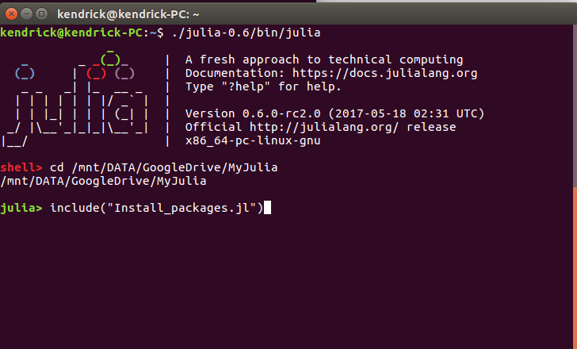

# Installing Julia

You can install the *pristine* Julia terminal by downloading the installation package from [here](https://julialang.org/downloads/) or you can use the alternative [JuliaPro](http://juliacomputing.com/products/juliapro.html) package which includes the [Juno IDE](http://junolab.org/), the Gallium debugger, and a number of packages for plotting, optimization, machine learning, databases and more.

If you choose to install the Julia terminal, make sure to add all the packages we will be using in our talk. 

After the Julia terminal is installed in your system, open the Julia console or [REPL](https://en.wikibooks.org/wiki/Introducing_Julia/The_REPL) and

1. Add the jupyter notebook package [IJulia](https://github.com/JuliaLang/IJulia.jl)
```julia
Pkg.add("IJulia")
```
2. Add the profiling and performance package [BenchmarkTools](https://github.com/JuliaCI/BenchmarkTools.jl)
```julia
Pkg.add("BenchmarkTools")
```
3. Add the plotting packages [Plots](https://github.com/JuliaPlots/Plots.jl) and [PlotlyJS](https://github.com/sglyon/PlotlyJS.jl)
```julia
Pkg.add("Plots")
Pkg.add("PlotlyJS")
```
4. Add the packages for image processing [Images](https://github.com/JuliaImages/Images.jl) and [ImageMagick](https://github.com/JuliaIO/ImageMagick.jl)
```julia
Pkg.add("Images")
Pkg.add("ImageMagick")
```
5. Add packages for deep learning [Mocha](https://github.com/pluskid/Mocha.jl) and [TensorFlow](https://github.com/malmaud/TensorFlow.jl)
```julia
Pkg.add("Mocha")
Pkg.add(TensorFlow)
```
Or you can download the file *Install_packages.jl* and type in your REPL
```julia
include("Install_packages.jl")
```
Note that you will need to change the working directory of the REPL so that it will be able to find and execute the file. To do this, type *;* to activate the *shell prompt* then use the shell commands to change the directory. For instance in Ubuntu, you could do:



If you choose to install the JuliaPro version, verify that it has the required packages already installed.
By typing the command ```using **PckName**``` you should be able to do it.

With Julia on and running in your system, we are ready to dive in. Hope you will enjoy it as much as I did.
